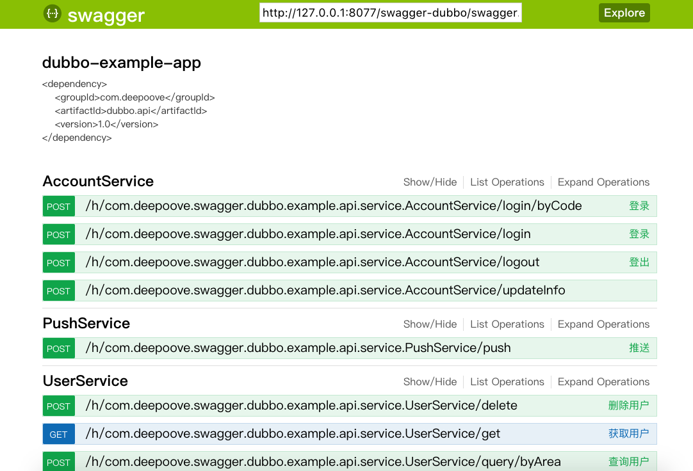
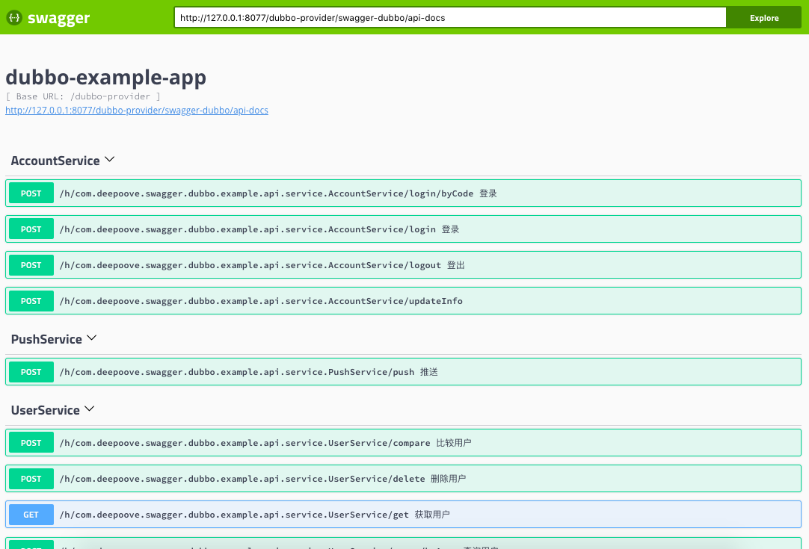

## dubbo-provider spring MVC 示例

spring mvc启动前准备：

1. 修改Zookeeper配置：dubbo-provider/src/main/resources/application/remote-provider.xml

```xml
<dubbo:registry address="zookeeper://127.0.0.1:2181" client="curator" />
```

运行web容器，若context为dubbo-provider：

### 访问如下url查看swagger数据

```
http://127.0.0.1:8077/dubbo-provider/swagger-dubbo/api-docs
```

### 访问swagger-ui 2.x

```
http://127.0.0.1:8077/dubbo-provider/distv2/index.html
```


### 访问swagger-ui 3.x

```
http://127.0.0.1:8077/dubbo-provider/distv/index.html
```
